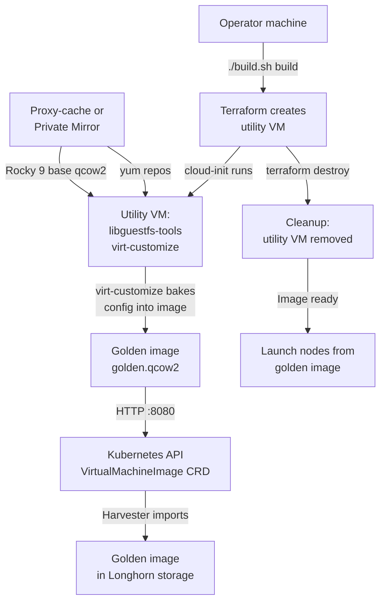
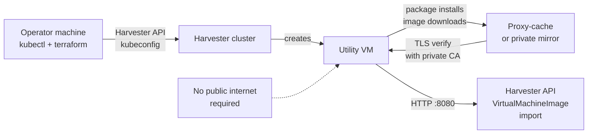

# Harvester RKE2 Golden Image Builder


**Pre-bake Rocky 9 QCOW2 images for RKE2 Kubernetes nodes on Harvester HCI — reproducible, airgap-ready, with static node configuration baked in.**

## Overview

This tool cuts RKE2 node boot time from 55-140 seconds down to 20-30 seconds by pre-baking all static configuration into a golden image. Every node launched from this image starts with:

- RKE2 and SELinux repositories configured
- Essential packages installed and updated
- Network configuration (policy routing for dual-NIC worker nodes)
- Security hardening (iptables rules, ARP snooping protection)
- Private CA certificates trusted (for internal registries and mirrors)
- System configuration tuned for KubeVirt/Harvester virtualization
- Machine identity cleared (SSH keys and machine-id regenerated by cloud-init at boot)

**Single source of truth**: When you rebuild the golden image, all future nodes get the same configuration. No more node-by-node config drift.

**Airgap-first**: All package downloads go through your proxy-cache or private mirror. No public internet required.

## How It Works



## Network Flow (Airgap)



## What Gets Baked Into the Golden Image

| Component | Details |
|-----------|---------|
| **Repositories** | RKE2 common + versioned repos (e.g., 1.34), Rocky 9 BaseOS/AppStream, EPEL — all via proxy-cache with private CA trust |
| **Essential packages** | qemu-guest-agent, iptables, iptables-services, container-selinux, policycoreutils-python-utils, audit, rke2-selinux |
| **Firewall rules** | iptables rules with INPUT DROP (except k8s ports 22, 6443, 9345, etc.) and OUTPUT DROP with RFC1918 safety net + DNS/NTP |
| **Network config** | ARP snooping protection (arp_ignore=1, arp_announce=2) — critical for dual-NIC worker nodes. NetworkManager dispatcher for policy routing on eth1 |
| **Security hardening** | Private CA certificate chain installed. SELinux relabeled. Audit enabled. |
| **Virtualization tuning** | Dracut configured for virtio drivers (virtio_blk, virtio_net, virtio_scsi, virtio_pci, virtio_console). Generic initramfs (not host-specific) for KubeVirt compatibility |
| **Boot loader** | GRUB entries cleaned up (libguestfs contamination removed). net.ifnames=0 applied for predictable NIC naming |
| **System state** | machine-id truncated to 0. SSH host keys removed. cloud-init regenerates both at first boot |
| **RKE2 manifests dir** | /var/lib/rancher/rke2/server/manifests pre-created for GitOps |

## Prerequisites

- **Harvester cluster** with at least 30 GB free storage capacity
- **kubectl** configured for Harvester access
- **Terraform** >= 1.5.0 with Harvester and Kubernetes providers
- **jq** for JSON parsing
- **Proxy-cache or private mirror** with:
  - Rocky 9 GenericCloud qcow2 base image
  - Rocky 9 BaseOS, AppStream, and EPEL repositories
  - RKE2 common and versioned repositories
  - All accessible via HTTPS with private CA certificates
- **Private CA certificates** in PEM format (passed to the builder)

## Quick Start

```bash
# Clone this repo (or copy to your workspace)

cd golden-image

# Copy the example config

cp terraform.tfvars.example terraform.tfvars

# Edit for your environment

# - Point to your proxy-cache/mirror URLs

# - Set your Harvester namespace

# - Add private CA certificate

# - Optional: add SSH keys for debug access to the builder VM

vi terraform.tfvars

# Build the golden image (full lifecycle: create → wait → import → cleanup)

# Takes 10-20 minutes depending on builder VM size and mirror performance

./build.sh build

# List existing golden images

./build.sh list

# When done, reference the image in your cluster Terraform

# (See "Integration with RKE2 Cluster" below)

```

## Configuration

Copy `terraform.tfvars.example` to `terraform.tfvars` and configure these variables:

| Variable | Description | Example |
|----------|-------------|---------|
| `harvester_kubeconfig_path` | Path to Harvester kubeconfig | `./kubeconfig-harvester.yaml` |
| `vm_namespace` | Harvester namespace for VMs and images | `rke2-prod` |
| `harvester_network_name` | VM network name | `vm-network` |
| `harvester_network_namespace` | VM network namespace | `default` |
| `rocky_image_url` | URL to Rocky 9 GenericCloud qcow2 (proxy-cache) | `https://yum.example.com/rocky/9/images/Rocky-9-GenericCloud-Base.qcow2` |
| `rocky_repo_url` | Base URL for Rocky 9 repos (proxy-cache) | `https://yum.example.com` |
| `rke2_repo_url` | Base URL for RKE2 repos (proxy-cache) | `https://yum.example.com/rke2/latest` |
| `private_ca_pem` | PEM-encoded CA certificate chain for TLS trust | (see below) |
| `builder_cpu` | vCPUs for utility VM (more = faster dnf) | `4` (default) |
| `builder_memory` | RAM for utility VM | `4Gi` (default) |
| `builder_disk_size` | Disk size for utility VM (needs ~2x qcow2 + tools) | `30Gi` (default) |
| `image_name_prefix` | Prefix for golden image name (date appended) | `rke2-rocky9-golden` (default) |
| `ssh_authorized_keys` | SSH keys for builder VM debug access (NOT baked into image) | `["ssh-ed25519 AAAA... user@host"]` |

### Example terraform.tfvars

```hcl
harvester_kubeconfig_path   = "./kubeconfig-harvester.yaml"
vm_namespace                = "rke2-prod"
harvester_network_name      = "vm-network"
harvester_network_namespace = "default"

builder_cpu       = 4
builder_memory    = "4Gi"
builder_disk_size = "30Gi"
image_name_prefix = "rke2-rocky9-golden"

# Your proxy-cache URLs (no public internet)

rocky_image_url = "https://yum.example.com/rocky/9/images/Rocky-9-GenericCloud-Base.latest.x86_64.qcow2"
rocky_repo_url  = "https://yum.example.com"
rke2_repo_url   = "https://yum.example.com/rke2/latest"

# Private CA certificate (required for HTTPS proxy-cache trust)

private_ca_pem = <<-EOT
-----BEGIN CERTIFICATE-----
MIIDXTCCAkWgAwIBAgIJAK1234567890AB...
...
-----END CERTIFICATE-----
EOT
```

## Commands

### `./build.sh build`

Full lifecycle: create utility VM → download and bake image → import to Harvester → cleanup.

Output:

- Prints the golden image name (e.g., `rke2-rocky9-golden-20260301`)
- Shows the time elapsed
- Instructs you to reference the image in cluster Terraform

Example output:

```text
============================================================
  Golden Image Build Complete
============================================================
  Image:     rke2-rocky9-golden-20260301
  Namespace: rke2-prod
  Time:      15m 23s

To use this image in your cluster, set in cluster/terraform.tfvars:
  golden_image_name = "rke2-rocky9-golden-20260301"
```

### `./build.sh list`

Show all golden images in your Harvester namespace with size and age.

```text
Golden images in namespace 'rke2-prod':

NAME                                 DISPLAY                          SIZE    PROGRESS  AGE
rke2-rocky9-golden-20260301          rke2-rocky9-golden-20260301      1.2Gi   100       2d
rke2-rocky9-golden-20260228          rke2-rocky9-golden-20260228      1.2Gi   100       5d
```

### `./build.sh delete <image-name>`

Delete an old golden image from Harvester.

```bash
./build.sh delete rke2-rocky9-golden-20260228
# Image 'rke2-rocky9-golden-20260228' deleted

```

### `./build.sh destroy`

Manual cleanup if the build fails mid-way. Destroys the utility VM and base image without waiting.

```bash
./build.sh destroy -auto-approve
```

## Integration with RKE2 Cluster

Once your golden image is built, reference it in your cluster Terraform:

```hcl
# In cluster/terraform.tfvars or cluster/variables.tf

golden_image_name = "rke2-rocky9-golden-20260301"
```

The cluster deployment will use this image for all new RKE2 nodes, replacing the default Rocky 9 GenericCloud base image.

**One-time setup**: The first time you build a golden image, you also need:

- `private_ca_pem` — same certificate chain used in the golden image builder
- `bootstrap_registry` — your proxy-cache registry (e.g., `yum.example.com`)

These are shared between the golden image builder and the cluster Terraform.

## How the Builder Works (Detailed)

1. **Terraform Apply** (phase 1/5)
   - Creates a temporary utility VM on Harvester with your base Rocky 9 image
   - Uploads cloud-init script that runs on the utility VM
   - Exports the utility VM's IP address for later use

2. **Cloud-Init on Utility VM** (happens automatically during boot)
   - Installs `libguestfs-tools-c` from your proxy-cache repos
   - Downloads the Rocky 9 GenericCloud qcow2 from your proxy-cache
   - Runs `virt-customize` to bake all configuration into the image

3. **virt-customize Customization** (the actual baking)
   - Copies private CA certificates into the image
   - Installs repository files (RKE2 common/versioned, Rocky BaseOS/AppStream, EPEL)
   - Installs essential packages
   - Configures dracut for virtio drivers (critical for KubeVirt boot)
   - Installs firewall rules (iptables)
   - Configures network ARP protection
   - Configures policy routing for dual-NIC workers
   - Cleans up package cache
   - Truncates machine-id and removes SSH host keys (regenerated at boot)
   - Relabels SELinux context

4. **Build Script Signals Ready** (phase 2/5)
   - Serves the completed `golden.qcow2` on HTTP `:8080`
   - build.sh polls the utility VM via in-cluster check pod until ready

5. **VirtualMachineImage Import** (phase 3/5)
   - Creates a Kubernetes `VirtualMachineImage` CRD pointing to the HTTP endpoint
   - Harvester downloads and imports the image into Longhorn storage with 3x replication

6. **Cleanup** (phase 5/5)
   - `terraform destroy` removes the utility VM and base image
   - Golden image remains in Harvester for future node deployments

## Security Considerations

### TLS and Certificate Verification

- All connections to your proxy-cache/mirror use HTTPS with private CA verification
- The private CA certificate is baked into the golden image
- Future RKE2 nodes automatically trust internal registries and mirrors

### Airgap Enforcement

- Iptables rules in the golden image restrict outbound traffic to RFC1918 private networks + DNS/NTP
- No accidental public internet leaks from cluster nodes
- Perfect for regulated or air-gapped environments

### Secret Hygiene

- SSH keys for the utility VM are **not** baked into the golden image
- They only exist on the temporary builder VM (destroyed after build)
- Private CA certificates **are** baked in (required for node operation)
- Terraform state contains no secrets (stored in Kubernetes backend, not committed to git)

### SELinux

- SELinux is re-enabled in the golden image
- rke2-selinux package is installed for policy enforcement
- Dracut rebuilds initramfs with SELinux support

## Troubleshooting

### Build hangs waiting for image import

Check Harvester storage capacity and network:

```bash
kubectl -n rke2-prod get virtualmachineimages rke2-rocky9-golden-20260301
kubectl -n rke2-prod describe virtualmachineimages rke2-rocky9-golden-20260301
```

### SSH to builder VM for debug (if build fails)

The script outputs the utility VM IP. If you added SSH keys to `terraform.tfvars`:

```bash
# From a host on the Harvester VM network

ssh rocky@<utility-vm-ip>
cat /var/log/build-golden.log
```

### Out of disk space on builder VM

Increase `builder_disk_size` in terraform.tfvars (default 30Gi). Each build needs:

- ~1.2 GB for downloaded Rocky 9 qcow2
- ~1.2 GB for the customized golden qcow2
- ~3-5 GB for libguestfs temporary files
- ~5 GB buffer

### Package installation failures

Verify your proxy-cache is serving the repos correctly:

```bash
# From any node on the cluster

curl -kv https://yum.example.com/rocky/9/BaseOS/x86_64/os/
```

If TLS fails, check that your `private_ca_pem` in terraform.tfvars is the complete certificate chain (root + intermediates if applicable).

## Performance Tips

- **Builder VM CPU**: Increase `builder_cpu` to 6-8 for faster package installation
- **Builder VM memory**: 4 GB is standard; no benefit beyond 8 GB for this workload
- **Proxy-cache caching**: Ensure your mirror has HTTP caching enabled for qcow2 downloads
- **Harvester network**: Golden image import speed depends on your Harvester storage backend (Longhorn) performance

## License

Apache License 2.0 — See LICENSE file for details.

## Contributing

This project is part of the harvester-rke2-platform ecosystem. For issues or PRs:

- Ensure all `.sh` files pass `shellcheck`
- Test Terraform changes with `terraform plan` before submitting
- Update this README if you add new variables or commands
